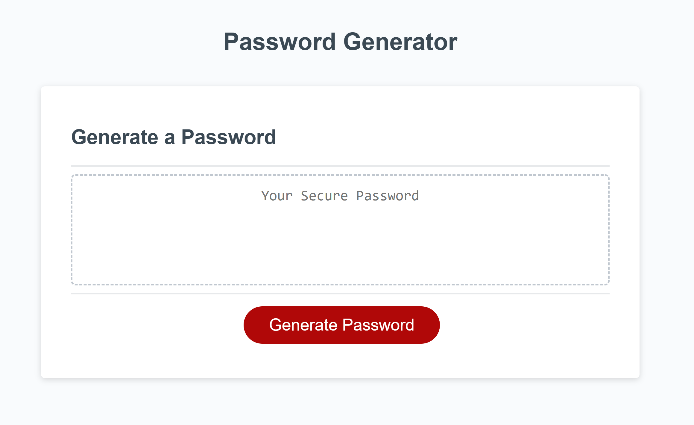

# Random Password Generator
JS Challenge: Password Generator

## Installation

N/A

## Description
This is a simple web based password generator that allows you to create a random password based on user input. You may choose the password's length and which characters you would like to include in the final result! Learned a lot about Javascript and the depths of despair with this project~ 

## Usage

Open the <a href="https://abbyjo.github.io/c3-passgen/">deployed page</a> on your favorite browser, click the "Generate Password" button and answer the prompts! The generated password will appear on the screen for you to copy.    

## Credits

Starter code provided by UCF and EdX. 
Fellow classmate Daniel Longacre helped with the code for alerting users of incorrect numerical values. I followed <a href="https://www.scaler.com/topics/password-generator-javascript/">this tutorial</a> in part for assistance with the randomization functions! 

## License

MIT License
